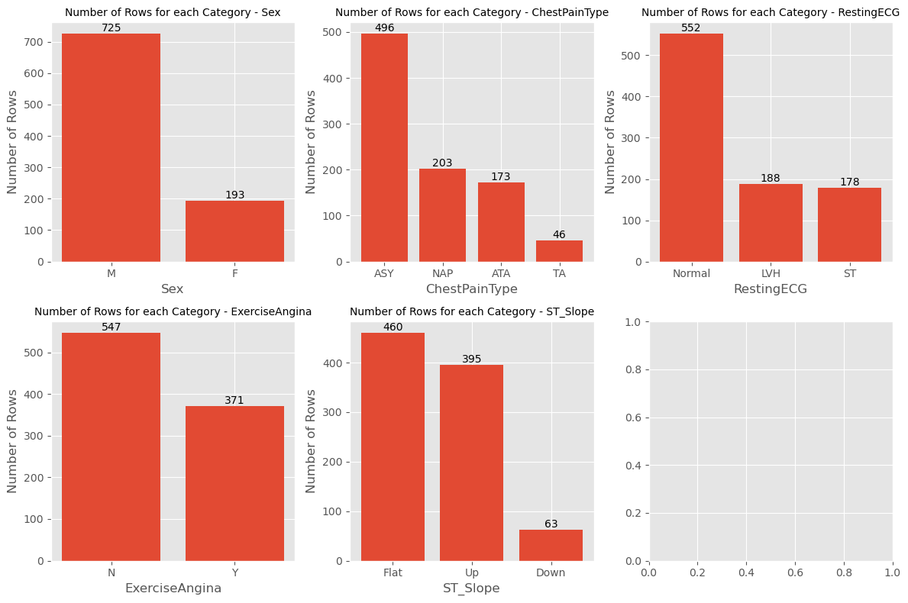
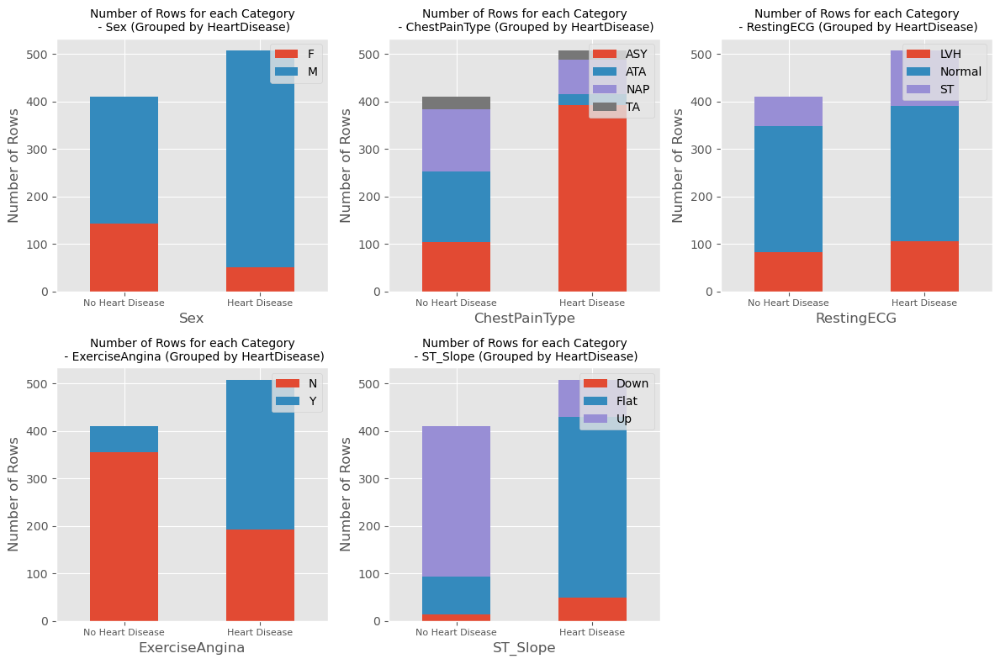
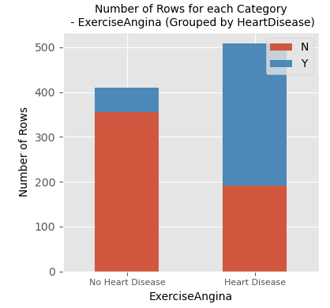
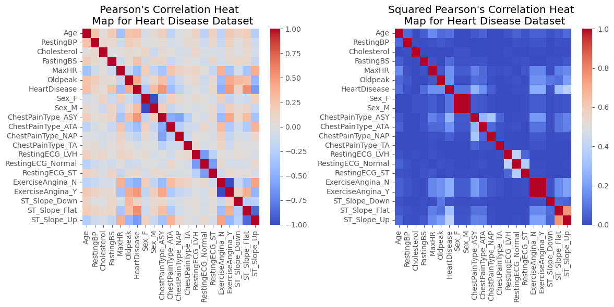

# Project: Predicting Heart Disease
---

This project aims to predict patients' likelihood of developing heart disease using ML. The dataset that is being used can be found [here](https://www.kaggle.com/datasets/fedesoriano/heart-failure-prediction) and also in the working dictory under file `heart_disease_prediction.csv`. 

The variables/columns within the dataset are as follows:

1. `Age`: age of the patient [years]
2. `Sex`: sex of the patient [M: Male, F: Female]
3. `ChestPainType`: chest pain type [TA: Typical Angina, ATA: Atypical Angina, NAP: Non-Anginal Pain, ASY: Asymptomatic]
4. `RestingBP`: resting blood pressure [mm Hg]
5. `Cholesterol`: serum cholesterol [mm/dl]
6. `FastingBS`: fasting blood sugar [1: if FastingBS > 120 mg/dl, 0: otherwise]
7. `RestingECG`: resting electrocardiogram results [Normal: Normal, ST: having ST-T wave abnormality (T wave inversions and/or ST elevation or depression of > 0.05 mV), LVH: showing
probable or definite left ventricular hypertrophy by Estes' criteria]

8. `MaxHR`: maximum heart rate achieved [Numeric value between 60 and 202]
9. `ExerciseAngina`: exercise-induced angina [Y: Yes, N: No]
10. `Oldpeak: oldpeak` = ST [Numeric value measured in depression]
11. `ST_Slope`: the slope of the peak exercise ST segment [Up: upsloping, Flat: flat, Down: downsloping]
12. `HeartDisease`: output class [1: heart disease, 0: Normal]


```python
import pandas as pd
import numpy as np

import matplotlib.pylab as plt
import seaborn as sns
plt.style.use('ggplot')


from sklearn.model_selection import train_test_split, GridSearchCV
from sklearn.preprocessing import MinMaxScaler
from sklearn.neighbors import KNeighborsClassifier

# set the display option to show all columns
pd.set_option('display.max_columns', None)


```

## 1. Data Exploring
---


```python
df = pd.read_csv('heart_disease_prediction.csv')
df.head()
```


<div>
<style scoped>
    .dataframe tbody tr th:only-of-type {
        vertical-align: middle;
    }

    .dataframe tbody tr th {
        vertical-align: top;
    }

    .dataframe thead th {
        text-align: right;
    }
</style>
<table border="1" class="dataframe">
  <thead>
    <tr style="text-align: right;">
      <th></th>
      <th>Age</th>
      <th>Sex</th>
      <th>ChestPainType</th>
      <th>RestingBP</th>
      <th>Cholesterol</th>
      <th>FastingBS</th>
      <th>RestingECG</th>
      <th>MaxHR</th>
      <th>ExerciseAngina</th>
      <th>Oldpeak</th>
      <th>ST_Slope</th>
      <th>HeartDisease</th>
    </tr>
  </thead>
  <tbody>
    <tr>
      <th>0</th>
      <td>40</td>
      <td>M</td>
      <td>ATA</td>
      <td>140</td>
      <td>289</td>
      <td>0</td>
      <td>Normal</td>
      <td>172</td>
      <td>N</td>
      <td>0.0</td>
      <td>Up</td>
      <td>0</td>
    </tr>
    <tr>
      <th>1</th>
      <td>49</td>
      <td>F</td>
      <td>NAP</td>
      <td>160</td>
      <td>180</td>
      <td>0</td>
      <td>Normal</td>
      <td>156</td>
      <td>N</td>
      <td>1.0</td>
      <td>Flat</td>
      <td>1</td>
    </tr>
    <tr>
      <th>2</th>
      <td>37</td>
      <td>M</td>
      <td>ATA</td>
      <td>130</td>
      <td>283</td>
      <td>0</td>
      <td>ST</td>
      <td>98</td>
      <td>N</td>
      <td>0.0</td>
      <td>Up</td>
      <td>0</td>
    </tr>
    <tr>
      <th>3</th>
      <td>48</td>
      <td>F</td>
      <td>ASY</td>
      <td>138</td>
      <td>214</td>
      <td>0</td>
      <td>Normal</td>
      <td>108</td>
      <td>Y</td>
      <td>1.5</td>
      <td>Flat</td>
      <td>1</td>
    </tr>
    <tr>
      <th>4</th>
      <td>54</td>
      <td>M</td>
      <td>NAP</td>
      <td>150</td>
      <td>195</td>
      <td>0</td>
      <td>Normal</td>
      <td>122</td>
      <td>N</td>
      <td>0.0</td>
      <td>Up</td>
      <td>0</td>
    </tr>
  </tbody>
</table>
</div>


```python
# Print number of feature and observations
num_features = df.shape[1]
num_observations = df.shape[0]

print("Number of features:", num_features)
print("Number of observations:", num_observations)
```

    Number of features: 12
    Number of observations: 918


```python
# Displaying variable  
df.dtypes
```


    Age                 int64
    Sex                object
    ChestPainType      object
    RestingBP           int64
    Cholesterol         int64
    FastingBS           int64
    RestingECG         object
    MaxHR               int64
    ExerciseAngina     object
    Oldpeak           float64
    ST_Slope           object
    HeartDisease        int64
    dtype: object


```python
# Getting categorical variables
categorical_columns = df.columns[df.dtypes == object]
categorical_columns
```


    Index(['Sex', 'ChestPainType', 'RestingECG', 'ExerciseAngina', 'ST_Slope'], dtype='object')


```python
# Displaying summary statistics of numerical types
df.describe()
```


<div>
<style scoped>
    .dataframe tbody tr th:only-of-type {
        vertical-align: middle;
    }

    .dataframe tbody tr th {
        vertical-align: top;
    }

    .dataframe thead th {
        text-align: right;
    }
</style>
<table border="1" class="dataframe">
  <thead>
    <tr style="text-align: right;">
      <th></th>
      <th>Age</th>
      <th>RestingBP</th>
      <th>Cholesterol</th>
      <th>FastingBS</th>
      <th>MaxHR</th>
      <th>Oldpeak</th>
      <th>HeartDisease</th>
    </tr>
  </thead>
  <tbody>
    <tr>
      <th>count</th>
      <td>918.000000</td>
      <td>918.000000</td>
      <td>918.000000</td>
      <td>918.000000</td>
      <td>918.000000</td>
      <td>918.000000</td>
      <td>918.000000</td>
    </tr>
    <tr>
      <th>mean</th>
      <td>53.510893</td>
      <td>132.396514</td>
      <td>198.799564</td>
      <td>0.233115</td>
      <td>136.809368</td>
      <td>0.887364</td>
      <td>0.553377</td>
    </tr>
    <tr>
      <th>std</th>
      <td>9.432617</td>
      <td>18.514154</td>
      <td>109.384145</td>
      <td>0.423046</td>
      <td>25.460334</td>
      <td>1.066570</td>
      <td>0.497414</td>
    </tr>
    <tr>
      <th>min</th>
      <td>28.000000</td>
      <td>0.000000</td>
      <td>0.000000</td>
      <td>0.000000</td>
      <td>60.000000</td>
      <td>-2.600000</td>
      <td>0.000000</td>
    </tr>
    <tr>
      <th>25%</th>
      <td>47.000000</td>
      <td>120.000000</td>
      <td>173.250000</td>
      <td>0.000000</td>
      <td>120.000000</td>
      <td>0.000000</td>
      <td>0.000000</td>
    </tr>
    <tr>
      <th>50%</th>
      <td>54.000000</td>
      <td>130.000000</td>
      <td>223.000000</td>
      <td>0.000000</td>
      <td>138.000000</td>
      <td>0.600000</td>
      <td>1.000000</td>
    </tr>
    <tr>
      <th>75%</th>
      <td>60.000000</td>
      <td>140.000000</td>
      <td>267.000000</td>
      <td>0.000000</td>
      <td>156.000000</td>
      <td>1.500000</td>
      <td>1.000000</td>
    </tr>
    <tr>
      <th>max</th>
      <td>77.000000</td>
      <td>200.000000</td>
      <td>603.000000</td>
      <td>1.000000</td>
      <td>202.000000</td>
      <td>6.200000</td>
      <td>1.000000</td>
    </tr>
  </tbody>
</table>
</div>


```python
# checking for any missing cells
df.isna().sum()
```


    Age               0
    Sex               0
    ChestPainType     0
    RestingBP         0
    Cholesterol       0
    FastingBS         0
    RestingECG        0
    MaxHR             0
    ExerciseAngina    0
    Oldpeak           0
    ST_Slope          0
    HeartDisease      0
    dtype: int64


---
**Observations from this Section:**

- There are 12 features, and 918 observations in the dataset
- Of the 12 feature 5 are nominal/categorical variables that will require converting to numerical if they are to used in the predictive model
- Following the 5 nominal/qualitative variables there are 7 numerical/quantitive variables
- There are no missing values in the dataset

**Based on the statistical summary above (summary of numerical data):**

- The average age of patients is ~53 years.
- The median for Cholesterol is higher than its mean by roughly 25 mm/dl, indicating that it could be a left-skewed distribution with a possibility of outliers skewing the distribution.
- RestingBP and Cholesterol have a minimum value of zero, which is no reasonable; therefore, these variable require some cleaning

## 2. Visulising the Raw Data
---

Creating frequency tables for all the categorical data


```python
# Set the figure size
num_rows = 2
num_cols = 3
fig, axes = plt.subplots(num_rows, num_cols, figsize=(12, 8))
num_plots = num_rows * num_cols
# Flatten the axes array if necessary
if num_plots == 1:
    axes = [axes]

# Iterate through each categorical column and create the bar chart
for i, column in enumerate(categorical_columns):
    row = i // num_cols
    col = i % num_cols
    
    # Count the number of rows for each category
    category_counts = df[column].value_counts()
    
    # Create a bar chart
    axes[row][col].bar(category_counts.index, category_counts.values)
    
    # Add labels and title
    axes[row][col].set_xlabel(column)
    axes[row][col].set_ylabel("Number of Rows")
    axes[row][col].set_title("Number of Rows for each Category - " + column, fontsize=10)
    
    # Add data labels
    for i, count in enumerate(category_counts):
        axes[row][col].text(i, count, str(count), ha='center', va='bottom')

# Remove any empty subplots
if num_plots < num_rows * num_cols:
    for i in range(num_plots, num_rows * num_cols):
        fig.delaxes(axes.flatten()[i])

# Adjust spacing between subplots
fig.tight_layout()

# Display the plot
plt.show()
```


    

    


```python
# Create a figure and axes for the subplots
fig, axes = plt.subplots(2, 3, figsize=(12, 8))

# Flatten the axes array for easy iteration
axes = axes.flatten()

# Iterate through each categorical column
for i, column in enumerate(categorical_columns):
    # Group the data by 'HeartDisease' and count the number of rows for each category
    grouped_counts = df.groupby(['HeartDisease', column]).size().unstack()

    # Set the current subplot
    ax = axes[i]

    # Create a stacked bar chart
    grouped_counts.plot(kind='bar', stacked=True, ax=ax)

    # Add labels and title
    ax.set_xlabel(column)
    ax.set_ylabel("Number of Rows")
    ax.set_title("Number of Rows for each Category\n - " + column + " (Grouped by HeartDisease)", fontsize=10)

    # Add a legend
    ax.legend(loc=1)
    
    # Set x-axis tick labels based on column values
    xtick_labels = ['No Heart Disease', 'Heart Disease']
    # Set x-axis tick labels font size and rotation
    ax.set_xticklabels(xtick_labels, fontsize=8, rotation=0)

# Remove any empty subplots
if len(categorical_columns) < len(axes):
    for j in range(len(categorical_columns), len(axes)):
        fig.delaxes(axes[j])

# Adjust the spacing between subplots
fig.tight_layout()

# Display the plot
plt.show()


```


    

    


```python
# Calculate the percentage of patients with heart disease who are male and over 50 years old
heart_disease_patients = df[df['HeartDisease'] == 1]

male_patients_over_50 = heart_disease_patients.query("Sex == 'M' and Age > 50")  # Using df.query instead
# male_patients_over_50 = heart_disease_patients[(heart_disease_patients['Sex'] == 'male') & (heart_disease_patients['Age'] > 50)]

percentage = (len(male_patients_over_50) / len(heart_disease_patients)) * 100

print("Percentage of heart disease patients who are male and over 50: ", percentage, '%')

```

    Percentage of heart disease patients who are male and over 50:  67.71653543307087 %


---
**Observations from this Section:**

- The dataset is highly skewed towards male patients. There are 725 male patients (`79%`) verse only 193 female patients (`21%`), which without investigating seems to not represent the total population of heart disease patients or patients presenting with a degree of chest pain. However, for the purposes of this project this sampling error will be ignored.

- 410 patients were not diagnosed with heart disease, whereas 508 patients were. The target variable is somewhat evenly distributed, which is beneficial for training our model.

- A significant number of patients, 392, diagnosed with heart disease have asymptomatic (ASY) chest pain. While chest pain could be a relevant feature for our model, it's should be noted that asymptomatic implies that those patients who had heart disease did not have chest pain as a symptom.

- A high number (170) of patients with blood sugar greater than 120 mg/dl were diagnosed with heart disease in relation to those who were not.

- The plot below shows that people that exercise are more likely to have heart disease which seem odd. There is likely more to this story, it could simply be that older people more concerned with their health and therefore exercise, if age and exercise correlates well? Might need to consider this more. Without research into way the data shows this relationship between exercise heart disease it will have to be removed as a feature for the ML model.




## 3. Data Cleaning
---

In this section the data is cleaned, although we previously observed that their were no missing values there are however a couple of colums with `0`that don't make sense.

There are a few ways we can handle these values:

1. We could remove those rows entirely if their frequency of occurrence is low.

2. We could impute those zeros with the median value of that column or the median value of the column grouped by HeartDisease.

3. We could try some complex approaches. For example, instead of using the median of the entire column, maybe we could look at the median of the values grouped by the age, sex, and/or resting ECG of the patient. The resting blood pressure of a female in her 30s with a normal ECG might be lower than what we would get from the median of the entire column.

For the purpose of this project option 3 will not be carried out as the project aim is to improve ML skills not to clean data.


```python
# Count the number of rows with 0 value for RestingBP
restingbp_zeros_count = (df['RestingBP'] == 0).sum()
print('Count the number of rows with 0 value for RestingBP: ', restingbp_zeros_count)

# Count the number of rows with 0 value for Cholesterol
cholesterol_zeros_count = (df['Cholesterol'] == 0).sum()
print('Count the number of rows with 0 value for Cholesterol: ', cholesterol_zeros_count)
```

    Count the number of rows with 0 value for RestingBP:  1
    Count the number of rows with 0 value for Cholesterol:  172


```python
# Remove rows with 0 values for RestingBP as there is only one row
df = df[(df['RestingBP'] != 0)]

# Rechecking -- Count the number of rows with 0 value for RestingBP
restingbp_zeros_count = (df['RestingBP'] == 0).sum()
print('Count the number of rows with 0 value for RestingBP should now be 0: ', restingbp_zeros_count)
```

    Count the number of rows with 0 value for RestingBP should now be 0:  0


```python
# Replace 0 values with the median value of the 'Cholesterol' column
df.loc[df['Cholesterol'] == 0, 'Cholesterol'] = df['Cholesterol'].median()

# Rechecking -- Count the number of rows with 0 value for Cholesterol
cholesterol_zeros_count = (df['Cholesterol'] == 0).sum()
print('Count the number of rows with 0 value for Cholesterol should now be 0:', cholesterol_zeros_count)

```

    Count the number of rows with 0 value for Cholesterol should now be 0: 0


## 4. Feature Selection
---

This section goes through a feature selection process. But keep in mind the following.


**A Note on Feature Selection**

---
In feature selection for machine learning, it is important to consider both positively and negatively correlated features with the target variable. The decision of including or excluding features should be based on their relevance and predictive power for the target variable, regardless of whether the correlation is positive or negative.

Here are a few points to consider:

1. Positive correlation: Features that have a positive correlation with the target variable indicate that an increase in the feature value is associated with an increase in the target variable. These features can provide valuable information and can be useful for predicting the target.

2. Negative correlation: Features that have a negative correlation with the target variable indicate that an increase in the feature value is associated with a decrease in the target variable. These features can also provide valuable information and might have a predictive power that should not be ignored.

3. Non-linear relationships: Correlation measures linear relationships, but in some cases, the relationship between a feature and the target variable might be non-linear. In such cases, solely relying on correlation might not capture the full picture. It is important to consider other techniques such as feature engineering or nonlinear models to capture these relationships effectively.

4. Multicollinearity: When multiple features are highly correlated with each other, it can lead to multicollinearity issues in the model. In such cases, you may need to select only one representative feature or use techniques like regularization to handle multicollinearity.


Selecting features using the square of the Pearson correlation coefficient instead of the raw correlation coefficient can be a reasonable approach in certain scenarios. It has its own advantages and considerations. Here are some points to consider:

1. Non-linearity: By squaring the correlation coefficient, you are effectively capturing the non-linear relationship between the feature and the target variable, which the raw correlation coefficient might not fully capture. This can be particularly useful when the relationship between the variables is non-linear.

2. Feature importance: The square of the correlation coefficient provides a measure of the explained variance or contribution of the feature to the target variable. Higher values indicate stronger influence and importance. This approach can help prioritize features that have a stronger impact on the target variable.

3. Balanced consideration: Using the square of the correlation coefficient allows you to consider both positively and negatively correlated features without the need for separate treatment. It gives equal weight to both types of correlations and helps identify features with significant relationships, regardless of the direction of correlation.

4. Interpretability: While the square of the correlation coefficient is useful for feature selection, keep in mind that it might not always provide a straightforward interpretation in terms of the underlying relationship between variables. It should be used as a quantitative metric for selecting features rather than solely relying on it to infer the nature or causality of the relationship.

5. Multicollinearity: When using the square of the correlation coefficient, it's important to consider potential multicollinearity among the selected features. Strongly correlated features can still lead to multicollinearity issues, which may require additional techniques like regularization or dimensionality reduction to address.
---

##### One-hot encode the categorical features


```python
df_features_selection = pd.get_dummies(data = df, columns = categorical_columns.to_list(), drop_first=False)
```


```python
# Compute the correlation matrix
correlation_matrix = df_features_selection.corr(numeric_only=True)
correlation_matrix_squared = correlation_matrix ** 2

# Create the subplots
fig, axes = plt.subplots(1, 2, figsize=(12, 6))

# Plot the first heatmap
sns.heatmap(correlation_matrix, annot=False, cmap='coolwarm', vmin=-1, vmax=1, ax=axes[0])
axes[0].set_title("Pearson's Correlation Heat \n Map for Heart Disease Dataset")


# Plot the second heatmap
sns.heatmap(correlation_matrix_squared, annot=False, cmap='coolwarm', vmin=0, vmax=1, ax=axes[1])
axes[1].set_title("Squared Pearson's Correlation Heat \n Map for Heart Disease Dataset")


# Adjust spacing between subplots
plt.tight_layout()

# Show the plot
plt.show()

```


    

    


```python
# Select the top 5 features with highest correlation
top_5_features_pearson = correlation_matrix["HeartDisease"].sort_values(ascending=False)[1:6].index.to_list()
top_5_features_pearson_squaured = correlation_matrix_squared["HeartDisease"].sort_values(ascending=False)[1:6].index.to_list()

# Select the bottom 5 features with lowest correlation
bottom_5_features_pearson  = correlation_matrix["HeartDisease"].sort_values(ascending=True)[1:6].index.to_list()
bottom_5_features_pearson_squaured = correlation_matrix_squared["HeartDisease"].sort_values(ascending=True)[1:6].index.to_list()

# Create a DataFrame with top and bottom features
selected_features_df = pd.DataFrame({'Top 5 Features Pearson': top_5_features_pearson, 
                                     'Bottom 5 Features Pearson': bottom_5_features_pearson,
                                     'Top 5 Features Pearson Sqaured': bottom_5_features_pearson_squaured, 
                                     'Bottom 5 Features Pearson Sqaured': top_5_features_pearson_squaured,
                                     })

selected_features_df
```


<div>
<style scoped>
    .dataframe tbody tr th:only-of-type {
        vertical-align: middle;
    }

    .dataframe tbody tr th {
        vertical-align: top;
    }

    .dataframe thead th {
        text-align: right;
    }
</style>
<table border="1" class="dataframe">
  <thead>
    <tr style="text-align: right;">
      <th></th>
      <th>Top 5 Features Pearson</th>
      <th>Bottom 5 Features Pearson</th>
      <th>Top 5 Features Pearson Sqaured</th>
      <th>Bottom 5 Features Pearson Sqaured</th>
    </tr>
  </thead>
  <tbody>
    <tr>
      <th>0</th>
      <td>ST_Slope_Flat</td>
      <td>ExerciseAngina_N</td>
      <td>Cholesterol</td>
      <td>ST_Slope_Up</td>
    </tr>
    <tr>
      <th>1</th>
      <td>ChestPainType_ASY</td>
      <td>ChestPainType_ATA</td>
      <td>ChestPainType_TA</td>
      <td>ST_Slope_Flat</td>
    </tr>
    <tr>
      <th>2</th>
      <td>ExerciseAngina_Y</td>
      <td>MaxHR</td>
      <td>RestingECG_Normal</td>
      <td>ChestPainType_ASY</td>
    </tr>
    <tr>
      <th>3</th>
      <td>Oldpeak</td>
      <td>Sex_F</td>
      <td>RestingECG_ST</td>
      <td>ExerciseAngina_Y</td>
    </tr>
    <tr>
      <th>4</th>
      <td>Sex_M</td>
      <td>ChestPainType_NAP</td>
      <td>RestingBP</td>
      <td>ExerciseAngina_N</td>
    </tr>
  </tbody>
</table>
</div>


Based on the above correlations and general/domain knowledge
- Age
- Sex
- ChestPainType
- Cholesterol
- ST_slope
- FastingBS
- MaxHR
- RestingBP
- Oldpeak
- Resting_ECG
- ExerciseAngina (This might get dropped)

## 5. Building a Classifier 1
---

**Selecting features and applying one-hot encoding**


```python
features = ['Age', 'Sex', 'ChestPainType', 'RestingBP', 'Cholesterol', 'FastingBS',
            'RestingECG', 'MaxHR', 'ExerciseAngina', 'Oldpeak', 'ST_Slope'
            ]

# Perform one-hot encoding on categorical columns
df_features = pd.get_dummies(
    data=df, columns=categorical_columns.to_list(), drop_first=False)


# Extract the column names related to the features after one-hot encoding
onehot_features = [column_name for column_name in df_features.columns 
                   if any(feature in column_name for feature in features)]
```

**Splitting Data in Training, validation and test data**


```python
# TODO: Could split data as training and testing sets only as grid search for hyperparameters will be done later
# and this will automatically take care of the validation set

# Select the desired features from the DataFrame
X = df_features[onehot_features]
y = df_features["HeartDisease"]

# Splitting data into training, validation, and test sets with a 60:20:20 ratio
X_train, X_val, y_train, y_val = train_test_split(
    X, y, test_size=0.20, random_state=417)

X_train, X_test, y_train, y_test = train_test_split(
    X_train, y_train, test_size=0.20 * X.shape[0] / X_train.shape[0], random_state=417)
```

**Testing single features models to comfirm feature selection**


```python
# Initialize lists to store feature names and accuracies
feature_names = []
accuracies = []

# Iterate over the selected features
for feature in onehot_features:
    X_train_single_feature = X_train[[feature]]  # Select a single feature
    X_val_single_feature = X_val[[feature]]

    # Create and fit the k-NN classifier
    n_neighbors = 25  # Set the number of neighbors - this could be iterated over as well to get the best value
    classifier = KNeighborsClassifier(n_neighbors=n_neighbors)
    classifier.fit(X_train_single_feature, y_train)

    # Evaluate the model on the validation set
    accuracy = classifier.score(X_val_single_feature, y_val)
    
    # Append feature name and accuracy to the respective lists
    feature_names.append(feature)
    accuracies.append(accuracy)

    # Print the accuracy
    # print(f"Accuracy using {feature}: {accuracy}")
    
# Create a Pandas DataFrame with sorted feature names and accuracies
feature_accuracy_df = pd.DataFrame({"Feature": onehot_features, "Accuracy": accuracies})

# Sort the DataFrame based on the "Accuracy" column in descending order
df_sorted = feature_accuracy_df.sort_values(by="Accuracy", ascending=False).reset_index(drop=True)
df_sorted

```


<div>
<style scoped>
    .dataframe tbody tr th:only-of-type {
        vertical-align: middle;
    }

    .dataframe tbody tr th {
        vertical-align: top;
    }

    .dataframe thead th {
        text-align: right;
    }
</style>
<table border="1" class="dataframe">
  <thead>
    <tr style="text-align: right;">
      <th></th>
      <th>Feature</th>
      <th>Accuracy</th>
    </tr>
  </thead>
  <tbody>
    <tr>
      <th>0</th>
      <td>ST_Slope_Up</td>
      <td>0.809783</td>
    </tr>
    <tr>
      <th>1</th>
      <td>ST_Slope_Flat</td>
      <td>0.782609</td>
    </tr>
    <tr>
      <th>2</th>
      <td>ChestPainType_ASY</td>
      <td>0.744565</td>
    </tr>
    <tr>
      <th>3</th>
      <td>Oldpeak</td>
      <td>0.722826</td>
    </tr>
    <tr>
      <th>4</th>
      <td>ExerciseAngina_Y</td>
      <td>0.711957</td>
    </tr>
    <tr>
      <th>5</th>
      <td>ExerciseAngina_N</td>
      <td>0.711957</td>
    </tr>
    <tr>
      <th>6</th>
      <td>ChestPainType_ATA</td>
      <td>0.706522</td>
    </tr>
    <tr>
      <th>7</th>
      <td>Sex_F</td>
      <td>0.657609</td>
    </tr>
    <tr>
      <th>8</th>
      <td>Sex_M</td>
      <td>0.657609</td>
    </tr>
    <tr>
      <th>9</th>
      <td>ChestPainType_NAP</td>
      <td>0.619565</td>
    </tr>
    <tr>
      <th>10</th>
      <td>Age</td>
      <td>0.608696</td>
    </tr>
    <tr>
      <th>11</th>
      <td>Cholesterol</td>
      <td>0.597826</td>
    </tr>
    <tr>
      <th>12</th>
      <td>RestingBP</td>
      <td>0.586957</td>
    </tr>
    <tr>
      <th>13</th>
      <td>MaxHR</td>
      <td>0.576087</td>
    </tr>
    <tr>
      <th>14</th>
      <td>RestingECG_LVH</td>
      <td>0.559783</td>
    </tr>
    <tr>
      <th>15</th>
      <td>RestingECG_Normal</td>
      <td>0.559783</td>
    </tr>
    <tr>
      <th>16</th>
      <td>RestingECG_ST</td>
      <td>0.559783</td>
    </tr>
    <tr>
      <th>17</th>
      <td>FastingBS</td>
      <td>0.559783</td>
    </tr>
    <tr>
      <th>18</th>
      <td>ST_Slope_Down</td>
      <td>0.559783</td>
    </tr>
    <tr>
      <th>19</th>
      <td>ChestPainType_TA</td>
      <td>0.538043</td>
    </tr>
  </tbody>
</table>
</div>


**Observation from above**

- The variable n_neighbors was tested via trial and error which could be improved upon by iterating over a range of numbers

- For feature engineering/selection it we could remove all features that scored below 60% and features that correlate closely in order to avoid multicollinearity, for example:
    - ST_Slope_Up, ST_Slope_Flat, remove ST_Slope_Flat as its score is lower
    - ExerciseAngina_Y, ExerciseAngina_N, remove ExerciseAngina_N as its score is lower
    - Sex_F, Sex_M, remove Sex_M as its score is lower


**A note on improving the accuracy of the k-NN models, you can try the following approaches**

---

1. Feature Engineering: Explore the data and try to engineer new features or transform existing ones that might be more informative for the classification task. This can involve combining existing features, creating interaction terms, or applying mathematical transformations.

2. Feature Selection: Instead of using all the selected features, you can experiment with different feature subsets. You can try using domain knowledge or employ feature selection techniques such as Recursive Feature Elimination (RFE), feature importance from tree-based models, or correlation analysis to identify the most relevant features.

3. Hyperparameter Tuning: Experiment with different values of the hyperparameters, such as the number of neighbors (n_neighbors) in the k-NN classifier. Use techniques like cross-validation and grid search to find the optimal hyperparameter values that maximize the model's performance.

4. Data Preprocessing: Ensure that the data is properly preprocessed before training the model. This may involve handling missing values, handling outliers, scaling numerical features, and encoding categorical variables appropriately.

5. Model Selection: Consider trying different classifiers or ensemble methods to see if they provide better performance than k-NN for your specific dataset. Different algorithms may have varying strengths and weaknesses, so it's worth experimenting with alternative models.

6. Increase the Training Data: If feasible, obtaining more training data can help improve the model's accuracy by providing a larger and more diverse dataset for learning patterns and making predictions.

7. Remember that the effectiveness of these techniques can vary depending on the dataset and the specific problem at hand. It's essential to experiment, evaluate the results, and iterate to find the best approach for your particular scenario.

---

## 6. Building a Classifier 2
---

In Section 5 (Building a Classifier 1) only single features were used to predict heart disease. In this section we will combine all features and check the models accuracy. Further, we will remove some low scoring and highly correlated features (to avoid multicollinearity) and check the models accurarcy again.


**Scaling/Normalising the data**


```python
# Normalizing features
scaler = MinMaxScaler()
X_scaled = scaler.fit_transform(X)
X_train_scaled = scaler.transform(X_train)
X_val_scaled = scaler.transform(X_val)
X_test_scaled = scaler.transform(X_test)
```

**Testing K-NN classifier model with all features**


```python
# Create and fit the k-NN classifier
n_neighbors = 15  # Set the number of neighbors - this could be iterated over as well to get the best value
classifier = KNeighborsClassifier(n_neighbors=n_neighbors)

classifier.fit(X_train_scaled, y_train)

# Evaluate the model on the validation set
accuracy = classifier.score(X_val_scaled, y_val)

accuracy

```


    0.8858695652173914


**Reducing features based on Section 5 and retesting model's accuracy**


```python
# Assume X_train_scaled is a NumPy array
reduced_features = ['ST_Slope_Up',
                    'ChestPainType_ASY',
                    'Oldpeak',
                    'ExerciseAngina_Y',
                    'ChestPainType_ATA',
                    'Sex_F',
                    'ChestPainType_NAP',
                    'Age'
                    ]

# Get the column indices corresponding to the reduced features
feature_indices = [X_train.columns.get_loc(feature) for feature in reduced_features]

# Reduce the dimensionality of X_train_scaled (val and test too) using array indexing
X_train_reduced = X_train_scaled[:, feature_indices]
X_val_reduced = X_val_scaled[:, feature_indices]
X_test_reduced = X_test_scaled[:, feature_indices]
```


```python
# Create and fit the k-NN classifier
n_neighbors = 15
classifier = KNeighborsClassifier(n_neighbors=n_neighbors)
classifier.fit(X_train_reduced, y_train)

# Evaluate the model on the validation set
accuracy = classifier.score(X_val_reduced, y_val)
print(accuracy)

```

    0.8695652173913043


**Observations from Section 6.**

- Both models using multiple features performed far better than the single feature models in section 5.

- There was little difference between the model with reduced features verse the model with all the features. However, differnces in performace may increase as hyperparameter selection is optimised.

## 7. Hyperparameter Tuning
---

In this section we will optimise the hyperparmeters of the K-NN classifier model using a technique called `GridSearchCV`

**Spliting data into only training and test data as GridSearchCV takes care of validation data**


When using GridSearchCV, the purpose of the validation set is somewhat incorporated within the cross-validation process. GridSearchCV internally performs cross-validation to evaluate different hyperparameter combinations and select the best model based on a given scoring metric. Therefore, you don't explicitly need to provide a separate validation set when using GridSearchCV.

Here's how GridSearchCV works with respect to data splitting:

1. GridSearchCV splits the training data into multiple folds (default is 5-fold cross-validation).

2. For each hyperparameter combination, it trains a model on a subset of the training data (training folds) and evaluates its performance on the remaining subset (validation fold).

3. It repeats this process for all combinations of hyperparameters.

4. Finally, it selects the hyperparameter combination that yields the best performance based on the specified scoring metric.
So, with GridSearchCV, you only need to provide the training data (X_train_scaled and y_train). It takes care of the internal cross-validation for evaluating different hyperparameter combinations.


```python
# Select the desired features from the DataFrame
X = df_features[onehot_features]
y = df_features["HeartDisease"]


# Splitting data into training, validation, and test sets with a 60:20:20 ratio
X_train_grid, X_test_grid, y_train_grid, y_test_grid = train_test_split(
    X, y, test_size=0.20, random_state=417)

# Normalizing features
scaler = MinMaxScaler()
X_scaled = scaler.fit_transform(X)
X_train_scaled_grid = scaler.transform(X_train_grid)
X_test_scaled_grid = scaler.transform(X_test_grid)

# Reduce the dimensionality of X_train_scaled (val and test too) using array indexing
X_train_reduced_grid = X_train_scaled_grid[:, feature_indices]
X_test_reduced_grid = X_test_scaled_grid[:, feature_indices]
```

**Settting GridSearchCV Parameters to Test**

When using GridSearchCV, you can test various hyperparameters of the KNeighborsClassifier model. In addition to `n_neighbors` and `metric`, you can explore other parameters that may affect the performance of the model. Some common parameters to consider for KNeighborsClassifier are:

- weights: Determines how the neighbors are weighted when making predictions. Options include `uniform` (all neighbors have equal weight) and `distance` (closer neighbors have higher weight).

- algorithm: Specifies the algorithm used to compute the nearest neighbors. Options include `auto`, `ball_tree`, `kd_tree`, and `brute`.

- leaf_size: The size of the leaf node in the ball tree or KD tree. This parameter affects the speed of the construction and query but may impact the accuracy.

- p: The power parameter for the Minkowski distance metric. For p=1, it corresponds to the Manhattan distance, and for p=2, it corresponds to the Euclidean distance.


```python
grid_params = {
    "n_neighbors": range(1, 100),
    "metric": ["minkowski", "manhattan"],
    "weights": ["uniform", "distance"],
    "algorithm": ["auto", "ball_tree", "kd_tree", "brute"],
    "leaf_size": [10, 20, 30],
    "p": [1, 2]
}
```

**Grid search on base features**


```python
knn_1 = KNeighborsClassifier()

knn_grid_1 = GridSearchCV(knn_1, grid_params, scoring='accuracy')
knn_grid_1.fit(X_train_scaled_grid, y_train_grid)

best_score = knn_grid_1.best_score_
best_params = knn_grid_1.best_params_

print(f"Best model's accuracy: {best_score*100:.2f}")
print(f"Best model's parameters: {best_params}")
```

    Best model's accuracy: 87.58
    Best model's parameters: {'algorithm': 'auto', 'leaf_size': 10, 'metric': 'minkowski', 'n_neighbors': 65, 'p': 1, 'weights': 'distance'}


**Grid search on reduce feature set**


```python
knn_2 = KNeighborsClassifier()

knn_grid_2 = GridSearchCV(knn_2, grid_params, scoring='accuracy')
knn_grid_2.fit(X_train_reduced_grid, y_train_grid)

best_score = knn_grid_2.best_score_
best_params = knn_grid_2.best_params_

print(f"Best model's accuracy: {best_score*100:.2f}")
print(f"Best model's parameters: {best_params}")
```

    Best model's accuracy: 85.53
    Best model's parameters: {'algorithm': 'brute', 'leaf_size': 10, 'metric': 'minkowski', 'n_neighbors': 11, 'p': 1, 'weights': 'uniform'}


**Observations from Section 7.**

- The model preformed largely the same, this indicates that the number of neighbors is the most effective hyperparamter for this model and data set.

- When splitting the data the sample was fixed via `random_state=417` which could effect the models performance. It might be necessary to take iterate over many random samples of split data to further optimise the predictive performance.

## 8. Model Evaluation on Test Set
---


```python
# Get the best model from base feature set
best_model = knn_grid_1.best_estimator_

# Evaluate the best model on the test set
accuracy = best_model.score(X_test_scaled_grid, y_test_grid)
print("Accuracy on the validation set from base feature set:", accuracy)

# Get the best model from reduced feature set
best_model = knn_grid_2.best_estimator_

# Evaluate the best model on the test set
accuracy = best_model.score(X_test_reduced_grid, y_test_grid)
print("Accuracy on the validation set from reduce features:", accuracy)
```

    Accuracy on the validation set from base feature set: 0.8641304347826086
    Accuracy on the validation set from reduce features: 0.8532608695652174


## 9. Conclusion
---

The model was found to have an accuracy of approximately `85%`. This performance may be too low for use in real-health applications. If it were used to filter patients it likely that many with heart disease would be missed, however, such a model many help escalate the need for patient care. 

The performance in this case is limited by the dataset. If the data set was much large it would be easier to sample the patient population to be more representative of the general population. This is clearly a problem here with the data represented by `79%` male patients and only `21%` female (not to mention the lack of gender diversity). The size of the data also makes it difficult to remove outliers.
